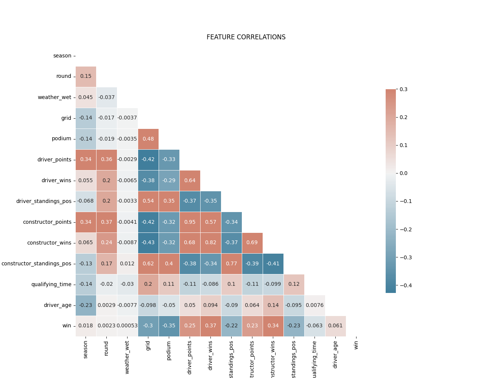
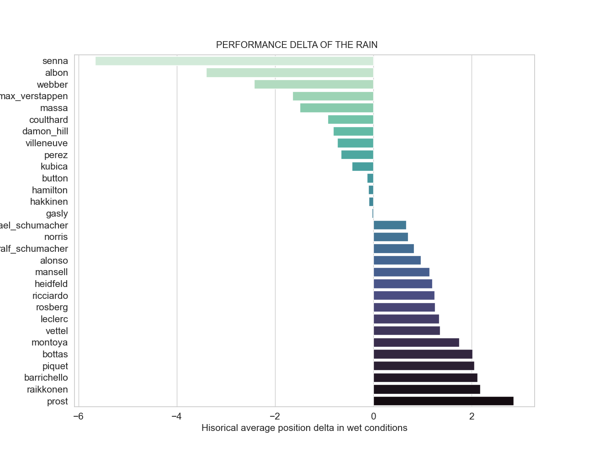
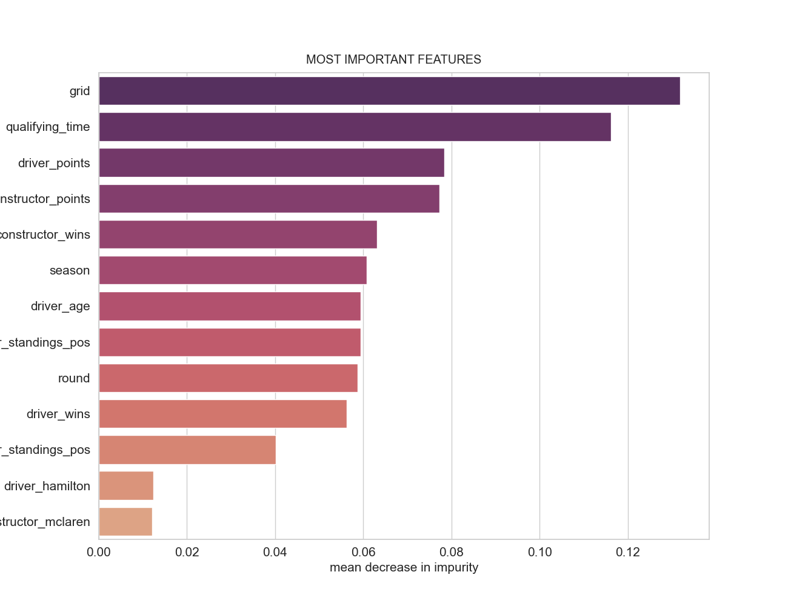

# F1 Race Winner Predictor

## Overview

* **Purpose:** to develop a Machine Learning classification model that predicts the winner of each race of the 2021 season of Formula 1. Ultimately, have a robust model that can beat the odds in the upcoming seasons (despite the regulation changes of 2022).
* [**Data source:**](https://github.com/felipesanze/F1_Predictor/blob/main/README.md#1-data-collection) scraped from the [Formula 1 website](https://www.formula1.com/) and the [Ergast F1](https://ergast.com/mrd/) API.
* [**Modeling:**](https://github.com/felipesanze/F1_Predictor/blob/main/README.md#4-modeling) built a tailor-made scoring function that evaluates predictions race after race and calculates a season-wide precision score. Used that score to compare and tune an `SVM`, a `Random Forest`, an `XGBoost`, and a `Logistic Regression`. `Neural networks` will be coming soon.
* **Results:** the model is able to predict the race winner with a 63% presicion score. That translates into right above half the races correctly predicted.

## 1. [Data Collection](https://github.com/felipesanze/F1_Predictor/blob/main/1_Collection.ipynb)

Data was scraped from the [Formula 1 website](https://www.formula1.com/) and the [Ergast F1](https://ergast.com/mrd/) API. Scraped seasons from 1983 to 2021.
Used the Beautiful Soup and Selenium libraries to scrape the 7 dataframes used for this project: `Races`, `Rounds`, `Results`, `Driver Championships`, `Constructors Championships`, `Qualifying`, and `Weather`. They can all be found in the data folder.

## 2. [Data Preprocessing](https://github.com/felipesanze/F1_Predictor/blob/main/2_Preprocessing.ipynb)

* Merged all DataFrames and dropped visibly redundant colums.
* Replaced missing values of `qualifying_time' by the average qualifying time for that team for that circuit. Missing values for points and position variables are assumed to be DNFs so they are replaced by 0.

### Feature Engineering

* `driver_age`: since race dates and driver birthdays are useless for our model, I decided to calculate the distant between the two and let driver age be a proxy for driver experience, which does affect likelihood of winning a race.
* `qualifying_time_delta`: since the absolute qualifying time can vary from circuit to circuit, I calculated a driver's time distance from the pole-sitter. This way quali time becomes comparable across circuits.
* `reg_era`: I bucketized the `season` variable into the different regulation eras in F1 history, as regulation changes can signify turning points for teams or drivers.
* `weather_wet`: wet conditions can have a significant impact in race results.

## 3. [EDA](https://github.com/felipesanze/F1_Predictor/blob/main/3_EDA.ipynb)

### 3.1. Feature Correlations

Weather-related features are not very correlated with final race position. I will drop them all but 'weather_wet' as I will use it for an analysis further down below.
`reg_era` could be a useful categorical variable for the modeling stage later. We must be careful with multicollinearity.
After dropping redundant columns the feature correlation matrix looks like this:

### 3.2. Circuits where qualifying matters the most

These are the 2021 circuits ranked by the correlation of final race position and qualifying position. We can see that even in the lower end of the list, qualifying position has a very significant correlaction with the race result. We can expect a high feature importance.

### 3.3. Historic performance of 2021 constructors

The purpose of this figure is not to have a precise histogram of race positions for every constructor. Instead, it aims to provide a smoothed view of the **distribution** of the historical race positions. This way, we can see that **Mercedes** has the heaviest skew, largelly due to them dominating during the **V6 Hybrid** era. On the other hand, an older team like **Williams** visibly has two modes that represent their golden days and their current back-marker performance. Team rebranding has been taken into account for `aston_martin`, `alpha_tauri` and `alpine`.

### 3.4. Average race finish position (wet and dry)

When it comes to overall driver performance, these are the top 10 drivers with the lowest all-time position average. Some things to point out:

* This is not far from the general public concensus of who the best drivers of all time are.
* Hamilton has the lowest average position by a significant margin to Prost.
* It is impressive how Max Verstappen takes the 4th spot this early in his career, over Michael Schumacher.

### 3.5. Performance delta of wet conditions

I separated the metric in `3.4.` into performance in wet vs dry conditions and calculated the average positions gained (left, green) or lost (right, blue) by a given driver when racing in wet conditions (for top 20 dry-comditions drivers).

* Overall, good drivers tend to score high.
* Good drivers in not so good cars benefit greatly from the rain. This is because drivers cannot go full push in the wet, making the difference in car performance smaller. This happened to George Russel in Spa in 2021, when he qualified 2nd with the slowest car... In the wet.

## 4. [Modeling](https://github.com/felipesanze/F1_Predictor/blob/main/4_Modeling.ipynb)

**Target variable:** `win` (i.e. did the driver win the race or not)

### 4.1. Main challenge

The main modeling challenge in this case is that the model will not predict the winner of each race if I pass it the entire dataset from 1983 to 2021. What we need it to do is to only see one race at a time and predict the winner. For this, I needed a custom made scoring and predicting function that processes race per race in batches.  
This also adds a layer of complexity to the model tunning process and to the evaluation of my results.

### 4.2. Prediction and scoring

For a given race:

* I run a classifier to predict the probability of winning for each driver
* Sort the predicted values in descending order of win probability
* Map the top driver to win = 1 and the rest to win = 0
* Calculate the race score as the 'precision_score` of that race
Model score:
* Model score is the (sum of precision_score of all races) / (number of races in the test season). In other words, the average race precision score.

### 4.3. Feature importance

* It makes sense that the qualifying result ('grid') be disproportionately more important than other features because it is the closest event to the actual race, especially in circuits where overtaking is more difficult. It is an indication of a driver's performance in 'lab conditions', without attacking, defending, or managing tyres.
* The accumulated constructor and driver points are an indication of how likely a driver will win given its positions in the past races of the season. They contain the year-to-date performance of a driver/constructor in a single number.
* Similarly, the driver's age is a proxy for their tenure or experience in F1 (the two are extremely correlated). It is the all-time hisory of the driver.
* Weather_wet turned out to be significantly less important than expected.

### 4.4. Results

The model is able to predict the race winner with a `63%` presicion score. That translates into right above half the races correctly predicted. I do not recommend using this model for betting purposes beyond the 2021 season. F1 regulations have suffered significant changes that make it unlikely that this model will perform well beyond 2021. I will revisit it after the 2022 season ends to evaluate that possibility.

## 5. Next Steps

* Put it all into production: Create an automated web interface where, right after qualifying on Saturday, the user presses a button, the fresh data gets scraped and run through the model. The user will get an expected winner for that weekend. Just for the fun of it...
* While estimating the probability of winning, we set the driver with the highest probability as the winner. What if we calculate the percentage difference between the predicted winner and the predicted P2? This could give us a sense of how certain the model is about its prediction for a given race.
* Using a GPU, build a Neural Network to hopefully improve the quality of our predictions.
* Use Variance Inflation Factor (VIF) to check for multicollinearity.
